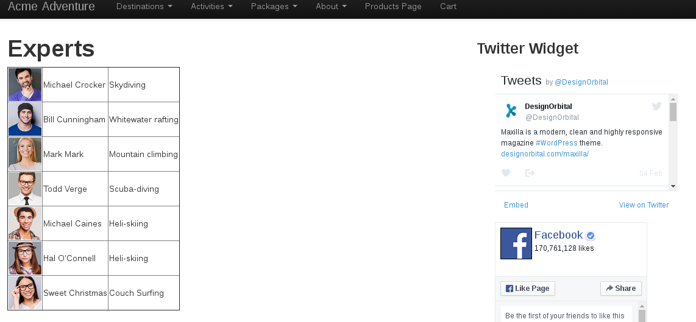
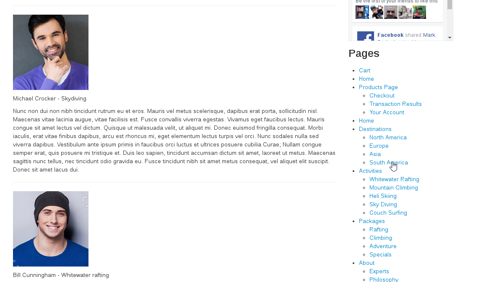

# WordPress-Theme-and-Plugin

First full wordpress theme build to replicate the look and feel of bootstrap. Fully responsive and internal menu system is connected to topline menu via navwalker(https://github.com/twittem/wp-bootstrap-navwalker) I was able to integrate. 

Home Screen and Menu.

First plugin: Takes info from DB about experts and displays it in table, full bios as well as allows for the tying in of events based on type to be able to display on activity pages. All placed via shortcodes.

print table of all experts in db.

print larger bio that auto links to the photo in the table above to allow for on page navigation.

Event listing when event is in the future

Event listing when no event is upcoming.

